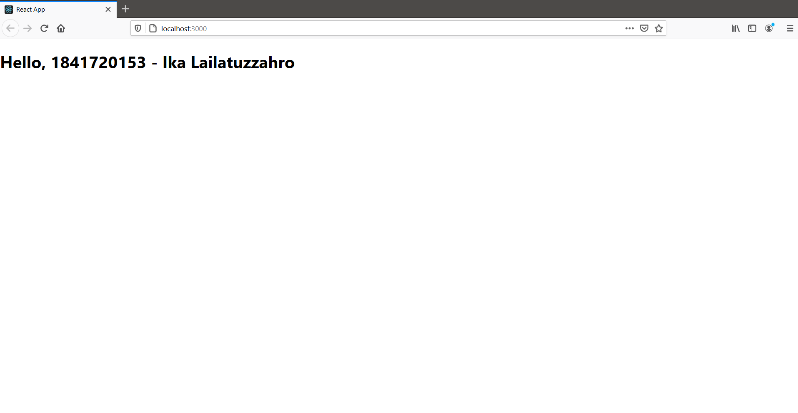
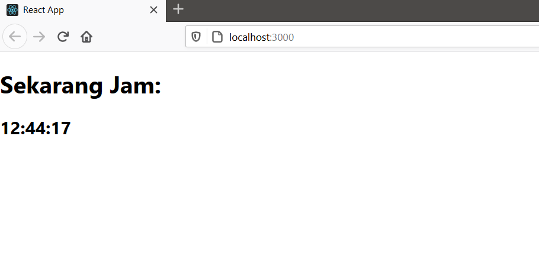
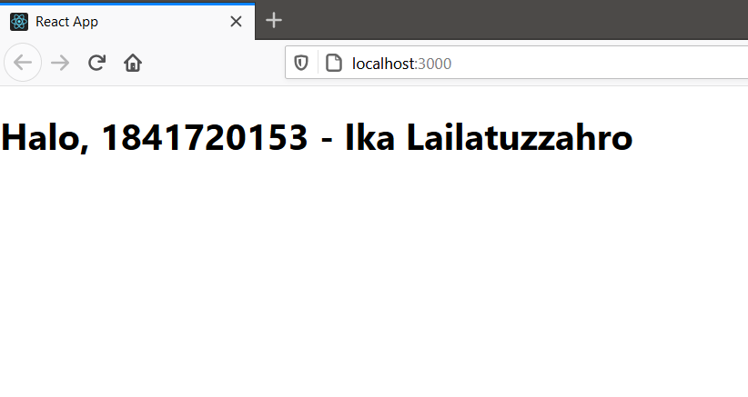
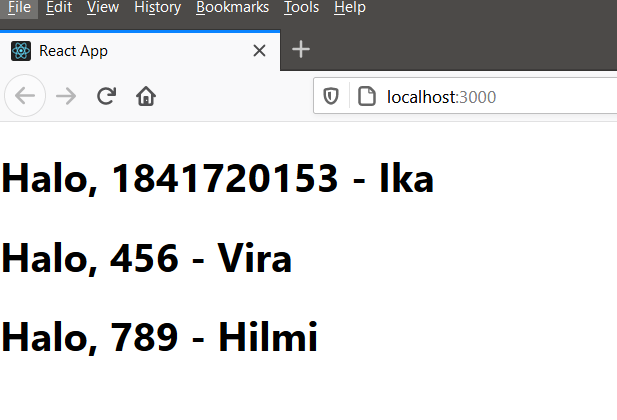
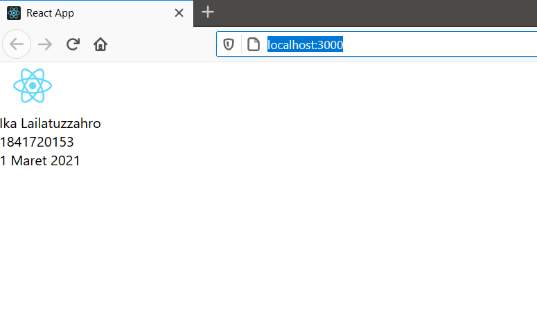
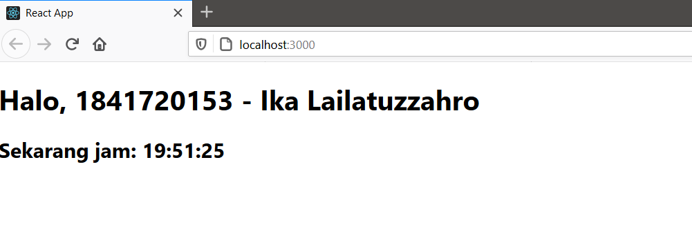

# 03 - Konsep Reactjs

## Tujuan Pembelajaran

1. Mahasiswa memahami konsep dasar ReactJS
2. Mahasiswa dapat membuat komponen dalam ReactJS

## Hasil Praktikum

1. Praktikum 1

[Link Praktikum 1](../../src/03_konsep_reactjs/Praktikum1/index.js)

2. Praktikum 2

[Link Praktikum 2](../../src/03_konsep_reactjs/Praktikum2/index.js)

3. Praktikum 3

[Link Praktikum 3](../../src/03_konsep_reactjs/Praktikum3/index.js)

4. Praktikum 4

[Link Praktikum 4 : index.js](../../src/03_konsep_reactjs/Praktikum4/index.js)
[Link Praktikum 4 : App.js](../../src/03_konsep_reactjs/Praktikum4/App.js)

5. Praktikum 5

[Link Praktikum 5](../../src/03_konsep_reactjs/Praktikum5/App.js)

6. Praktikum 6

[Link Praktikum 6](../../src/03_konsep_reactjs/Praktikum6/index.js)

