# 04 - Konsep Reactjs bagian 2

## Tujuan Pembelajaran

1. Mahasiswa memahami konsep dasar ReactJS
2. Mahasiswa dapat membuat komponen dalam ReactJS

## Hasil Praktikum

1. Praktikum 1

cara 1 : Membuat toggle button dengan binding this

sebelum klik on

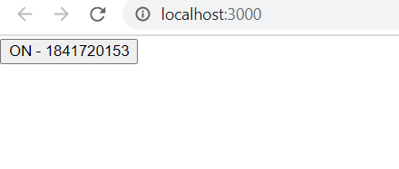

sesudah klik on

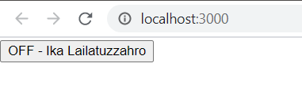

src : [Link Praktikum 1 cara 1](../../src/03_konsep_reactjs_bagian_2/praktikum1/index_cara1.js)

cara 2 : Membuat toggle button dengan class field dan arrow function

sebelum klik on

sesudah klik on

src : [Link Praktikum 1 cara 2](../../src/03_konsep_reactjs_bagian_2/praktikum1/index_cara2.js)

cara 3 : Membuat toggle button dengan arrow function saat pemanggilan

sebelum klik on

sesudah klik on

src : [Link Praktikum 1 cara 3](../../src/03_konsep_reactjs_bagian_2/praktikum1/index_cara3.js)

2. Praktikum 2

isLoggedIn={true}

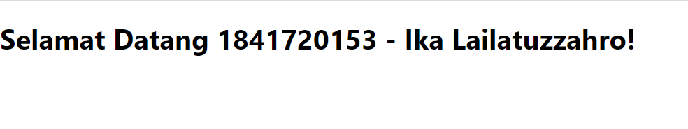

isLoggedIn={false}

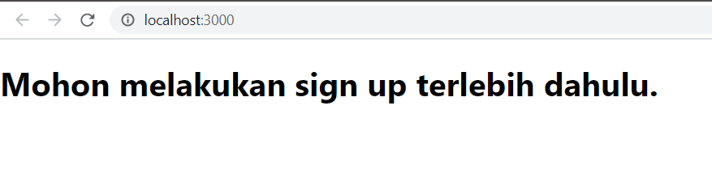

src : [Link Praktikum 2](../../src/03_konsep_reactjs_bagian_2/praktikum2/index.js)

3. Praktikum 3

sebelum klik login

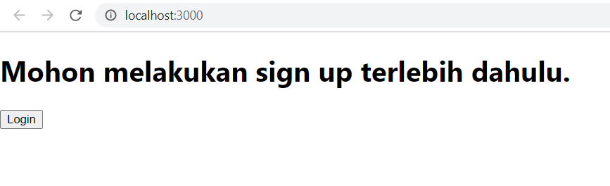

sesudah klik login

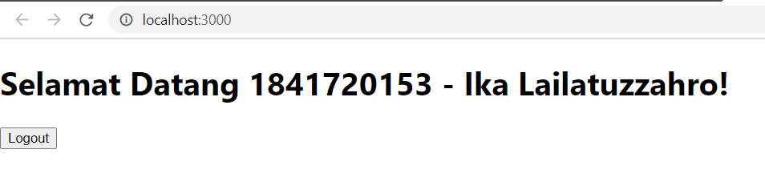

src : [Link Praktikum 3](../../src/03_konsep_reactjs_bagian_2/praktikum3/index.js)

4. Praktikum 4

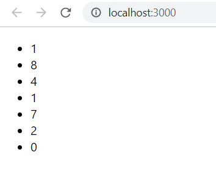

src : [Link Praktikum 4 : index.js](../../src/03_konsep_reactjs_bagian_2/praktikum4/index.js)

5. Praktikum 5

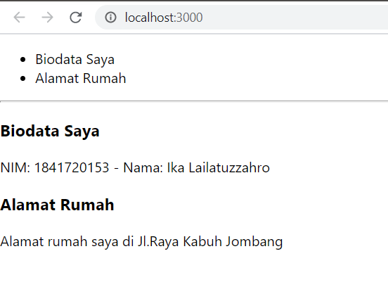

src : [Link Praktikum 5](../../src/03_konsep_reactjs_bagian_2/praktikum5/index.js)

6. Praktikum 6

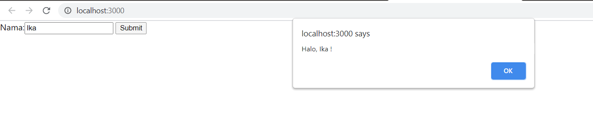

src : [Link Praktikum 6](../../src/03_konsep_reactjs_bagian_2/praktikum6/index_form.js)

Membuat textarea pada form

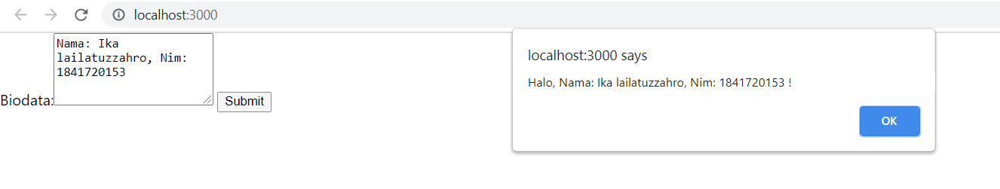

src : [Link Praktikum 6 textarea](../../src/03_konsep_reactjs_bagian_2/praktikum6/index_textarea.js)

Membuat select pada form

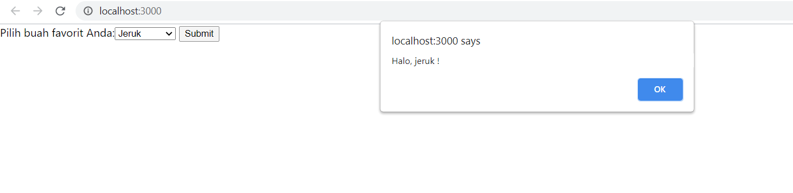

src : [Link Praktikum 6 select](../../src/03_konsep_reactjs_bagian_2/praktikum6/index_select.js)

Membuat multiple select

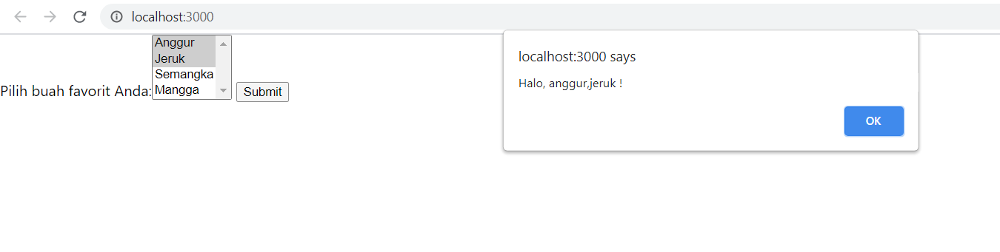

src : [Link Praktikum 6 multiple select](../../src/03_konsep_reactjs_bagian_2/praktikum6/index_multiple.js)

