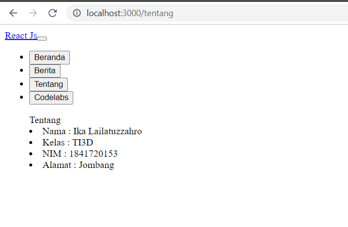

# 05 - API dan Router di reactJs

## Tujuan Pembelajaran

1. Mahasiswa memahami konsep dasar ReactJS
2. Mahasiswa dapat membuat komponen dalam ReactJS

## Hasil Praktikum

1. Praktikum 1 : Menampilkan data dari API

src : [Link Praktikum 1](../../src/05_API/praktikum1/index.js)

2. Praktikum 2 : Membuat routing sederhana

src : [Link Praktikum 2](../../src/05_API/praktikum2/index.js)

      [Link Praktikum 2](../../src/05_API/praktikum2/App.js)

3. Praktikum 3 : Membuat routing bersarang (Nested Routing)

src : [Link Praktikum 3](../../src/05_API/praktikum3/App.js)

4. Tugas : Berdasarkan pada praktikum sebelumnya yang telah dilakukan, 
Anda diminta untuk membuat tampilan halaman web tersebut lebih menarik dengan style atau tema dari bootstrap.

src : [Link Tugas App.js](../../src/05_API/tugas/App.js)
src : [Link Tugas index.js](../../src/05_API/tugas/index.js)