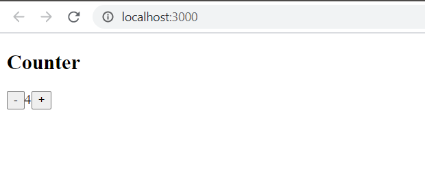
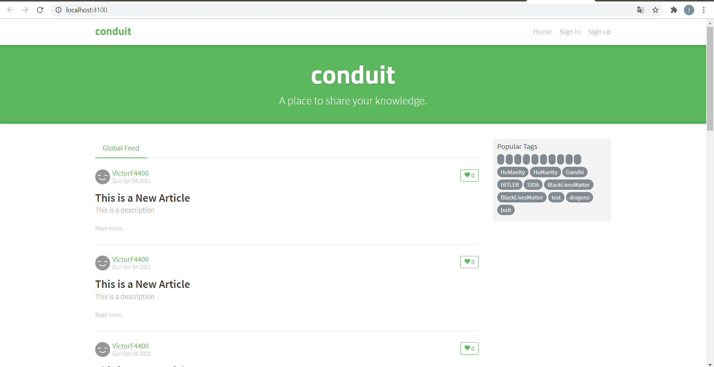
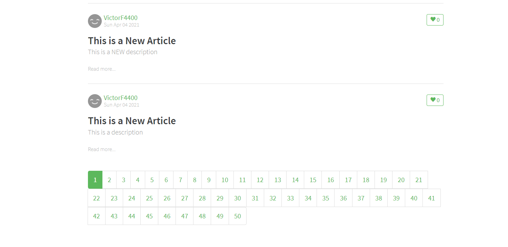

# 06 - React Redux

## Tujuan Pembelajaran

1. Mahasiswa dapat memahami konsep state management dalam redux
2. Mahasiswa dapat menerapkan redux dalam reactapp

### Hasil Praktikum1

[Kode Program App.js](../../src/06_redux/App.js)

[Kode Program index.js](../../src/06_redux/index.js)

## Tugas (Pertanyaan Praktikum)

Berdasarkan pada praktikum sebelumnya yang telah dilakukan, beberapa pertanyaan terkait praktikum perlu diselesaikan yaitu sebagai berikut.

1. Jelaskan maksud sintaks this.props.dispatch pada praktikum langkah 16 sebelumnya!

2. Jelaskan maksud istilah yang ada dalam Redux berikut ini:

Actions

Reducers

Action creators

Middleware

Pure functions

Immutability

3. Jelaskan maksud sintaks export default connect(mapStateToProps)(Counter) pada praktikum langkah 9 sebelumnya!

4. Carilah sebuah studi kasus aplikasi yang cukup kompleks di GitHub yang memanfaatkan Redux! Kemudian screenshot bagian kode program mana yang merupakan proses Redux dan jelaskan prosesnya! (cantumkan link repository GitHub yang Anda temukan)

Jawab :

1. Fungsinya untuk memanggil dan mengirimkan ke store dan mentrigger agar state berubah sesuai dengan yang diclick

2. a. Action = merupakan objek JavaScript ("{ }") yang memberitahu reducer untuk memodifikasi data. Syaratnya, action harus memiliki properti type berupa String.

    b. Reducers = sebuah fungsi yang memiliki kembalian data (return some data).

    c. Action Creators = fungsi yang mengembalikan suatu tindakan atau aksi.

    d. Middleware = Suatu point yang menjadi titik tengah saat mengirim aksi dan saat meraih reducers.

    e. Pure Function = Sebuah function yang jika diberi argumen yang sama maka akan menghasilkan output yang sama

    f. Immutability = Suatu objek yang tidak bisa dimodifikasi kembali setelah dibuat

3.  (MapStateToProps)(Counter) yaitu menerima counter store sebagai argumen. Ini mengembalikan objek yang menggambarkan bagaimana keadaan store dipetakan ke dalam properti.

4. 

   
   link: https://github.com/gothinkster/react-redux-realworld-example-app

    Pada folder reducers : Berisikan banyak file untuk menambahkan artikel,list artikel,home,profile,setting,dll
    

    Pada reducer.js : sebuah function untuk mengkombinasikan macam-macan reducer(file yg ada pada reducers)
    

    

