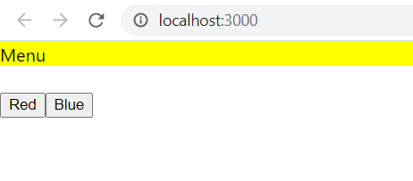
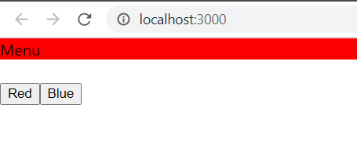
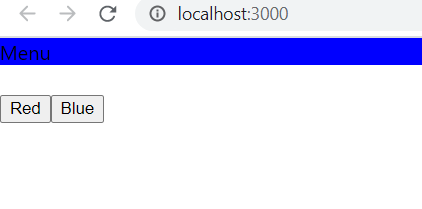

# 07 - Context and HOC

## Tujuan Pembelajaran

1. Mahasiswa mengetahui dan memahami konsep Context dan HOC dalam reactApp
2. Mahasiswa dapat membuat HOC dengan context API

### Hasil Praktikum

sebelum mengklik tombol

klik tombol merah

klik tombol biru

