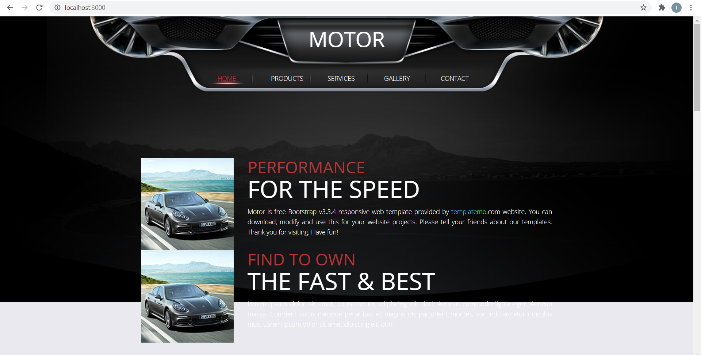
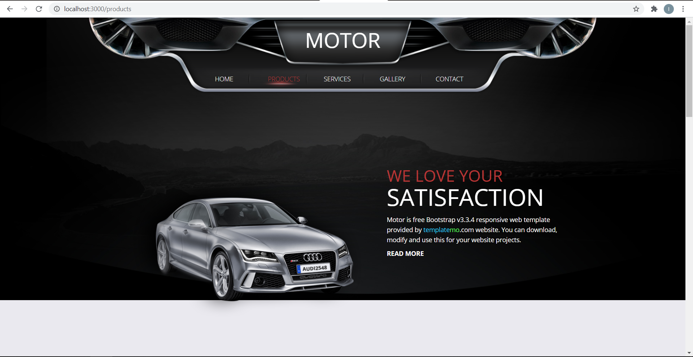
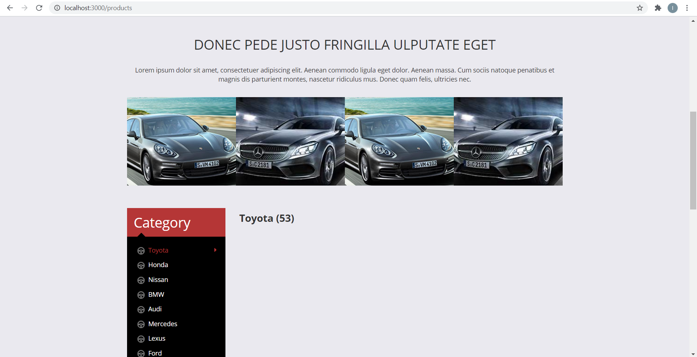
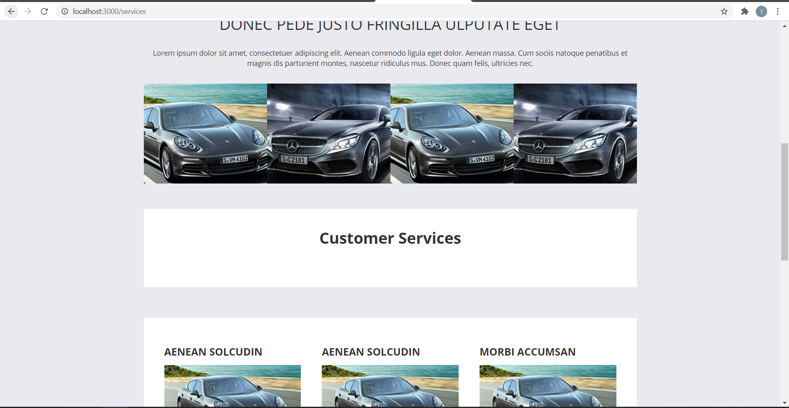
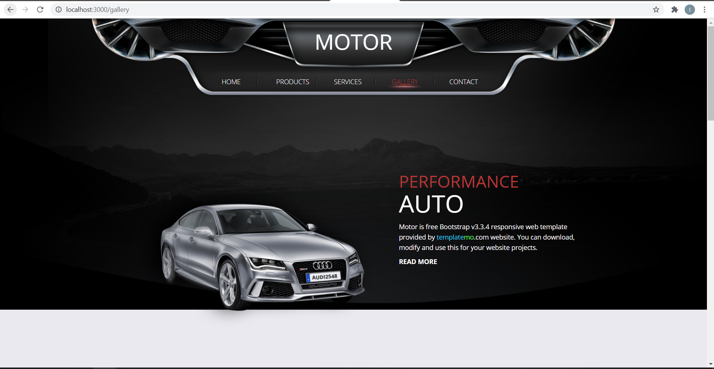
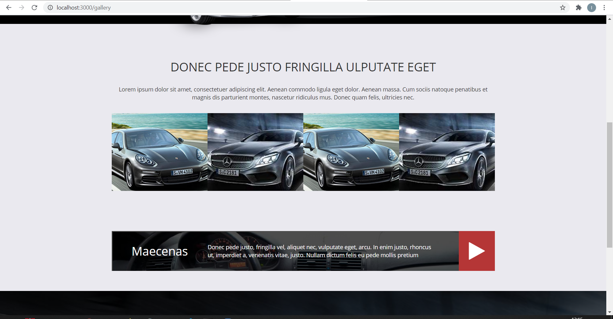
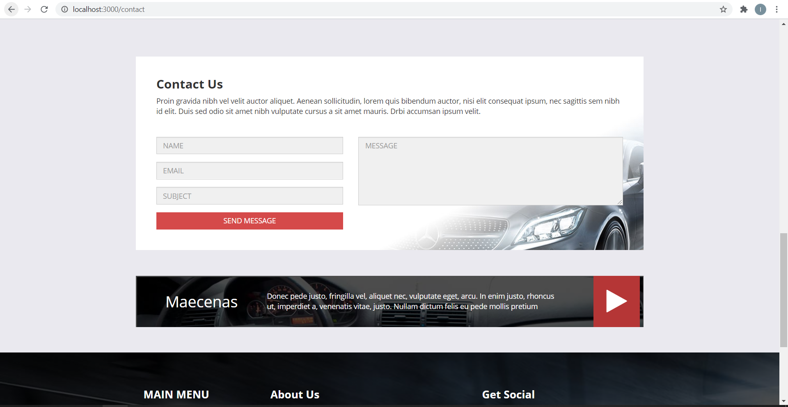
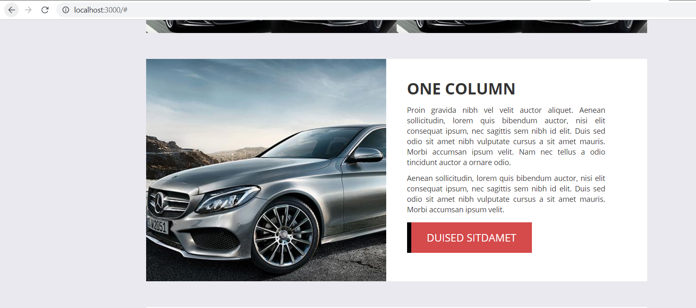
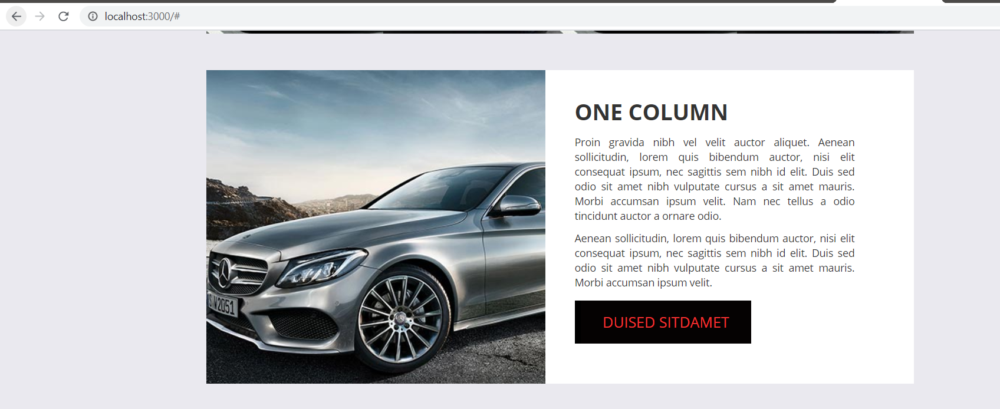

# 08 - UTS

## Soal

Anda diminta oleh sebuah perusahaan untuk mengonversi templat web pada tautan ini
https://s.id/templat-web (sesuai pembagian presensi dari dosen) menjadi sebuah aplikasi React.
Artinya, Anda harus mengubah HTML statis tersebut menjadi komponen-komponen React menjadi
sebuah Single-Page Application (SPA). Selain itu, ada permintaan spesifikasi lain, yaitu:

a. Anda diminta untuk menggunakan React Router pada setiap menu di web tersebut.

b. Anda diminta untuk meletakkan semua konten (seperti artikel, link gambar, komentar, dsb)
web di file JSON kemudian dipanggil dengan API (GET).

c. Anda diminta untuk menggunakan Redux agar konten web tersimpan di store, sehingga
proses GET API tidak membutuhkan waktu lebih lama (low latency).

## Struktur Penilaian

| No | Penilaian | Poin |
|--|--|--|
| 1 | Aplikasi React (SPA) | 30 |
| 2 | Menggunakan React Router setiap menu | 15 |
| 3 | Menggunakan API ke file JSON | 15 |
| 4 | Menggunakan Redux | 20 |
| 5 | React Project Structure Best Practices for Scalable Application | 10 |
| 6 | Ketepatan pengumpulan solusi, kerapian laporan dan penulisan | 10 | 

## Hasil 

### Home

### Products

### Services

### Gallery

### Contact

### Button

#### Sebelum diklik

#### Sesudah diklik

