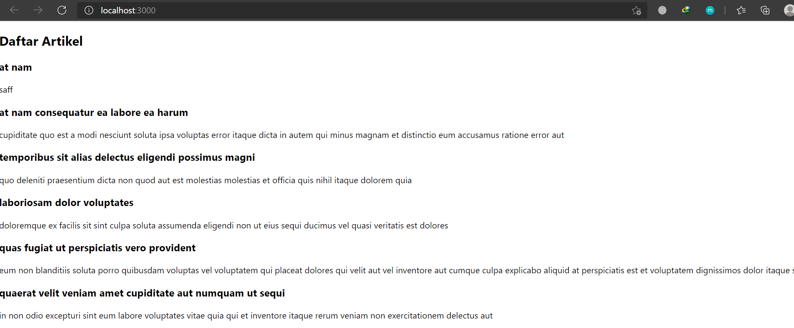
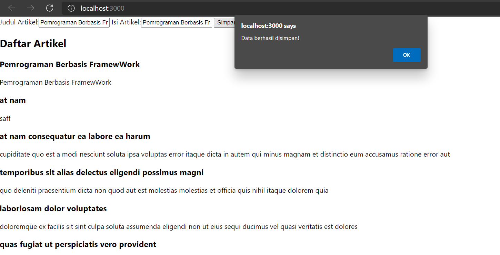
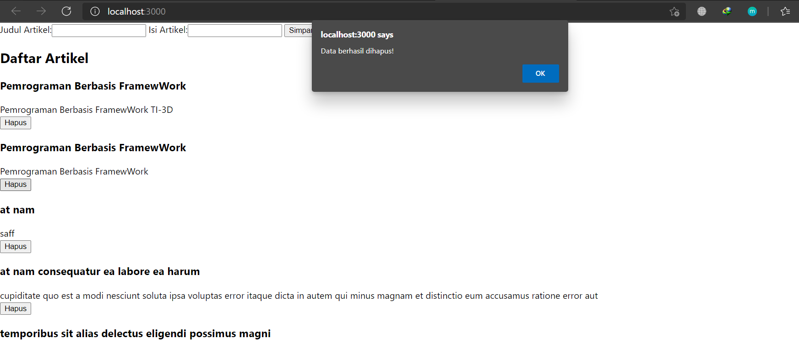
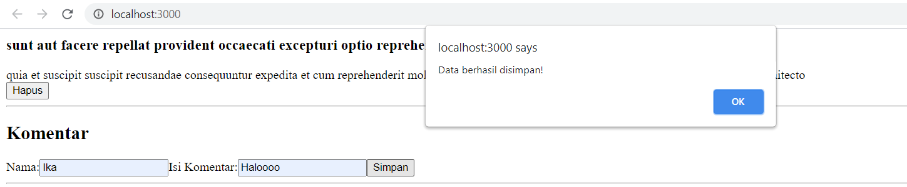
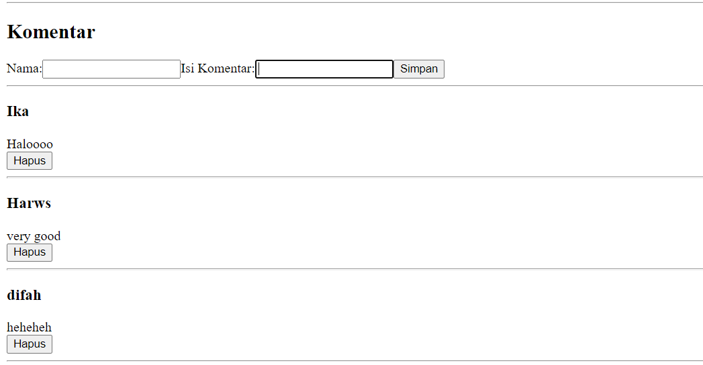
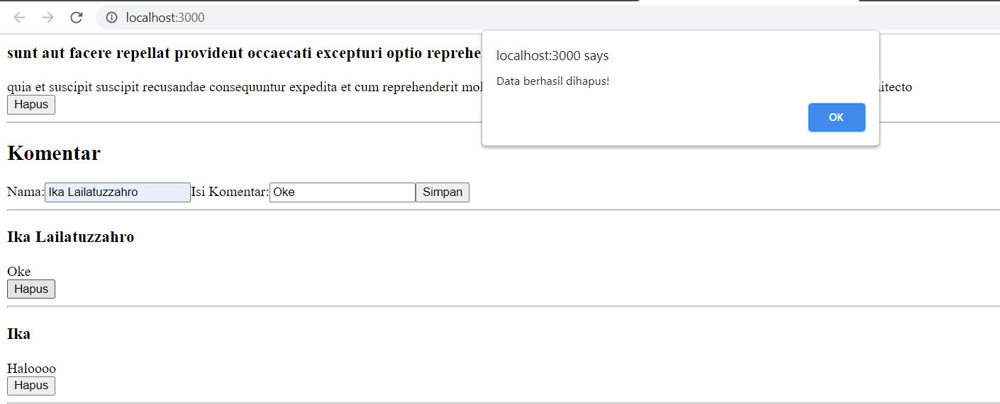

# 09 - Global Api Hooks

## Tujuan Pembelajaran
1. Membuat aplikasi sederhana menggunakan react hooks dan global API
2. Mengimplementasikan konsep Javascript untuk menyelesaikan studi kasus

### Hasil Praktikum

1. Praktikum 1

A. GET

B. POST

C. DELETE

2. Tugas Praktikum 1

POST

DELETE

## Pernyataan Diri

Saya menyatakan isi tugas, kode program, dan laporan praktikum ini dibuat oleh saya sendiri. Saya tidak melakukan plagiasi, kecurangan, menyalin/menggandakan milik orang lain.

Jika saya melakukan plagiasi, kecurangan, atau melanggar hak kekayaan intelektual, saya siap untuk mendapat sanksi atau hukuman sesuai peraturan perundang-undangan yang berlaku.

Ttd,

***(Ika Lailatuzzahro)*** 