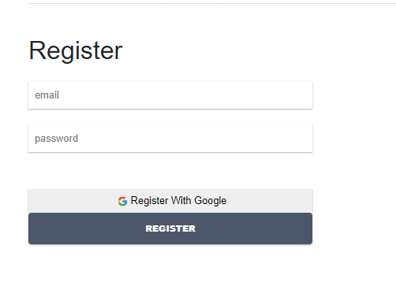
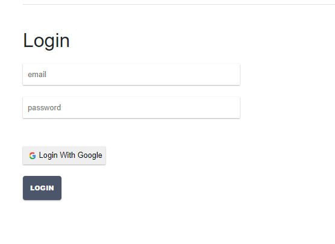
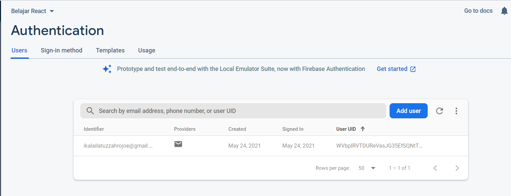
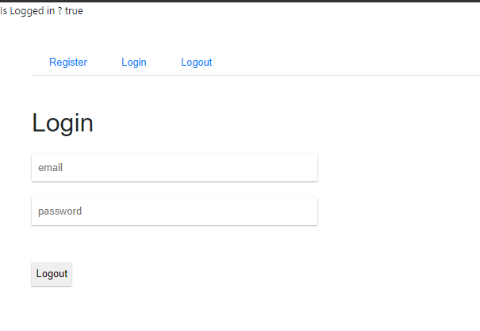

# 10_firebase_reactjs

## Tujuan Pembelajaran

Sebelum memulai codelab ini, sebaiknya Anda memiliki pengetahuan dasar tentang:

Pemrograman dasar dengan HTML, CSS, dan JavaScript
Cara membuat project baru di ReactJS
Konsep DOM (Document Object Model)
Konsep ReactJS Bagian 1
Konsep ReactJS Bagian 2
Apa yang Anda akan pelajari
Konsep dan implementasi Firebase di ReactJS

## Hasil Praktikum

### Praktikum 1: Membuat Form Register

### Praktikum 2: Membuat Form Login

### Praktikum 3: Membuat Koneksi ke Firebase

### Tugas

## Kesimpulan

Pada codelab kali ini, kita akan belajar untuk mengintegrasikan aplikasi React dengan firebase. Kita akan membuat fitur Register dan Login menggunakan fasilitas yang disediakan oleh firebase.

Silakan lanjutkan ke langkah berikutnya untuk memulai praktikum pada codelab ini.

## Pernyataan Diri

Saya menyatakan isi tugas, kode program, dan laporan praktikum ini dibuat oleh saya sendiri. Saya tidak melakukan plagiasi, kecurangan, menyalin/menggandakan milik orang lain.

Jika saya melakukan plagiasi, kecurangan, atau melanggar hak kekayaan intelektual, saya siap untuk mendapat sanksi atau hukuman sesuai peraturan perundang-undangan yang berlaku.

Ttd,

***(Ika Lailatuzzahro)***

