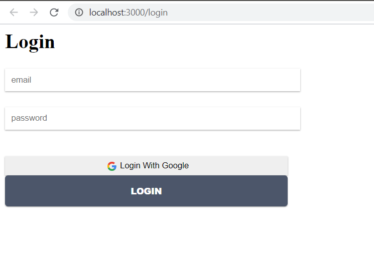
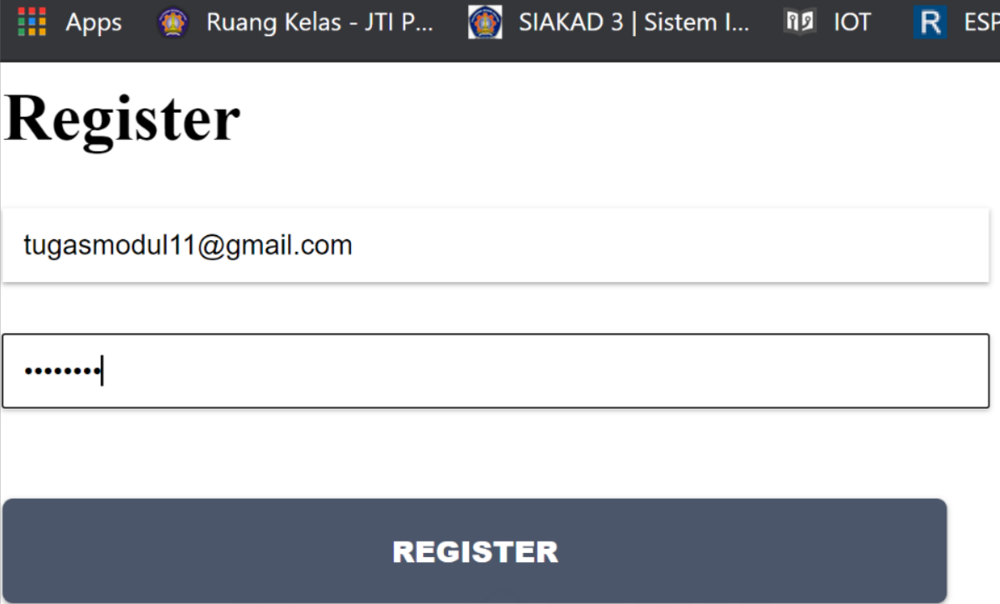

# 11_redux_thunk

## Tujuan Pembelajaran

Sebelum memulai codelab ini, sebaiknya Anda memiliki pengetahuan dasar tentang:

Pemrograman dasar dengan HTML, CSS, dan JavaScript
Cara membuat project baru di ReactJS
Konsep DOM (Document Object Model)
Konsep ReactJS Bagian 1
Konsep ReactJS Bagian 2
API dan Router di ReactJS
React Redux

## Hasil Praktikum

### Praktikum 1: Membuat Login dengan Firebase dan Redux Thunk

### Tugas Praktikum

1. Berdasarkan praktikum yang telah Anda lakukan, jelaskan perbedaan fitur yang ada dalam komponen Login dan Home! Mengapa komponen Login tidak menggunakan class seperti pada komponen Home ?

Jawab : Pada login terdapat fitur untuk login dengan memasukkan email dan password,sedangkan pada home terdapat halaman yang dan button keluar. Agar penulisan code rapi dan mempersingkat penulisan code

2. Jelaskan kegunaan dan alur logika dari protectedRoute.js !

Jawab : File ini berfungsi untuk memvalidasi status user yang berhasil login. Logika yang digunakan oleh function ini, memvalidasi nilai state yang disimpan di dalam store redux. Jika state value atau nilai false akan meredirect halaman login

3. Coba lakukan login dengan email atau password yang salah, apa yang terjadi? Jelaskan!

Jawab : Yang terjadi adalah akan muncul tulisan bahwa email atau password salah dan akan tetap berada di halaman login (Tidak bisa ke halaman home)

4. Jika Anda berada di halaman Home, coba akses form login tanpa melakukan logout. Apakah form login bisa diakses? Jelaskan!

Jawab : From login tidak bisa diakses, karena state isAuthenticated masih bernilai true. Maka file atau function protectedRoute.js tidak akan me-redirect ke halaman login
5. Tambahkan menu Register pada form login sehingga user yang belum terdaftar dapat melakukan registrasi! Jika registrasi sukses, maka user langsung diarahkan ke halaman Home.

Jawab : 

## Kesimpulan

Pada codelab kali ini, kita akan belajar untuk mengintegrasikan aplikasi React dengan firebase. Kita akan membuat fitur Register dan Login menggunakan fasilitas yang disediakan oleh firebase.

Silakan lanjutkan ke langkah berikutnya untuk memulai praktikum pada codelab ini.

## Pernyataan Diri

Saya menyatakan isi tugas, kode program, dan laporan praktikum ini dibuat oleh saya sendiri. Saya tidak melakukan plagiasi, kecurangan, menyalin/menggandakan milik orang lain.

Jika saya melakukan plagiasi, kecurangan, atau melanggar hak kekayaan intelektual, saya siap untuk mendapat sanksi atau hukuman sesuai peraturan perundang-undangan yang berlaku.

Ttd,

***(Ika Lailatuzzahro)***

