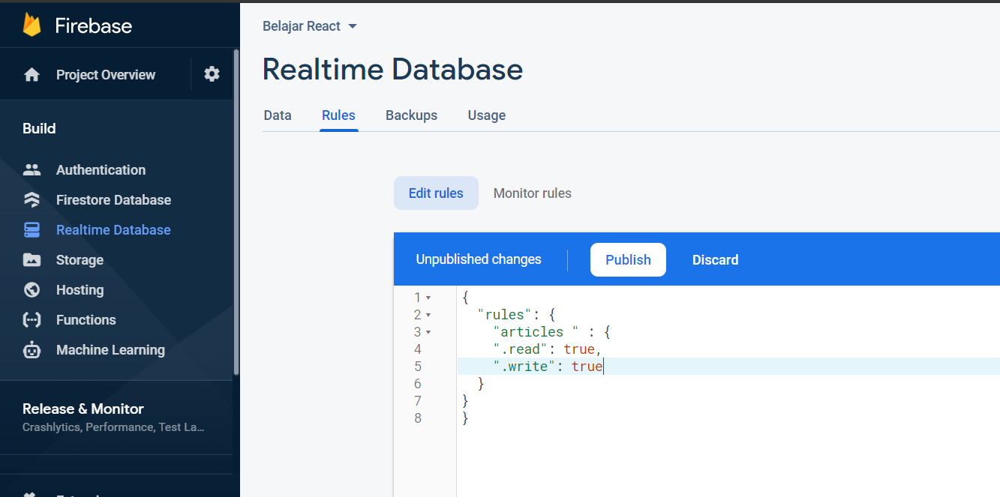
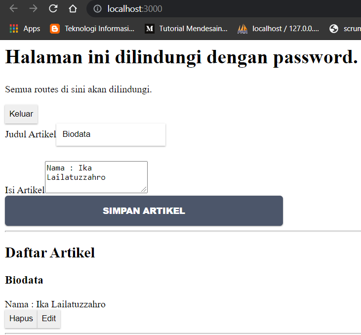
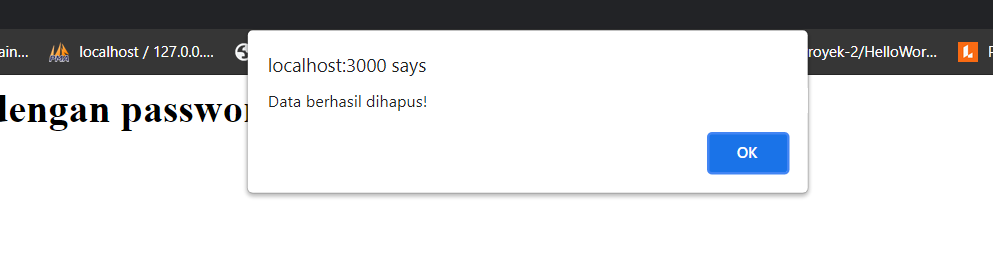
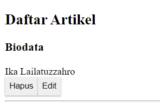

# 12 - CRUD Firebase

## Tujuan Pembelajaran

1. Mahasiswa memahami konsep interaksi dengan Firebase
2. Mahasiswa dapat membuat komunikasi CRUD ke Firebase dengan ReactJS

## Hasil Praktikum

- Praktikum 1

    

- Praktikum 2

    
    

- Praktikum 3

    

- Praktikum 4

## Hasil Tugas Praktikum 

1. Berdasarkan praktikum 1 yang telah Anda lakukan, jelaskan perbedaan fungsi locked mode dan test mode pada langkah 3 saat Anda konfigurasi database Firebase?

    Jawab : Pada fungsi locked mode hanya akan memberi akses kepada diri sendiri (user) sedangkan pada test mode akses diberikan kepada seluruh user.

2. Buatlah variabel userId pada praktikum 2 langkah 4 agar dapat menyimpan email dari user yang sedang login, sehingga dapat tersimpan di database!

    Jawab : 

3. Jelaskan maksud kode ini (dataArtikel || []) pada praktikum 2 langkah 6! Mengapa berbeda dari codelabs sebelumnya untuk menampilkan daftar artikel?

    Jawab :

4. Lengkapilah kode pada praktikum 4 langkah 5 agar dapat melakukan update artikel! Mengapa setelah klik tombol Update Artikel, form Modal tidak hilang? Bagaimana Anda mengatasi hal tersebut?

    Jawab :

5. Ketika Anda menekan tombol Edit, lalu menekan tombol Batal pada form Modal update artikel. Kemudian coba tambah artikel baru, maka artikel yang tadi kita klik tombol Edit akan berubah jadi data yang artikel baru ditambahkan. Mengapa demikian? Silakan diperbaiki.

    Jawab :

## Kesimpulan

Pada codelab ini Anda akan mempelajari tentang Create, Read, Update, dan Delete (CRUD) dengan Firebase di ReactJS. 
Codelab 9 sebelumnya Anda telah membuat Global API untuk berinteraksi dengan database JSON secara lokal. 
Nah, codelab saat ini kita akan membuat interaksi dengan database yang disediakan oleh Firebase secara online.

## Pernyataan Diri

Saya menyatakan isi tugas, kode program, dan laporan praktikum ini dibuat oleh saya sendiri. Saya tidak melakukan plagiasi, kecurangan, menyalin/menggandakan milik orang lain.

Jika saya melakukan plagiasi, kecurangan, atau melanggar hak kekayaan intelektual, saya siap untuk mendapat sanksi atau hukuman sesuai peraturan perundang-undangan yang berlaku.

Ttd,

***(Ika Lailatuzzahro)***
