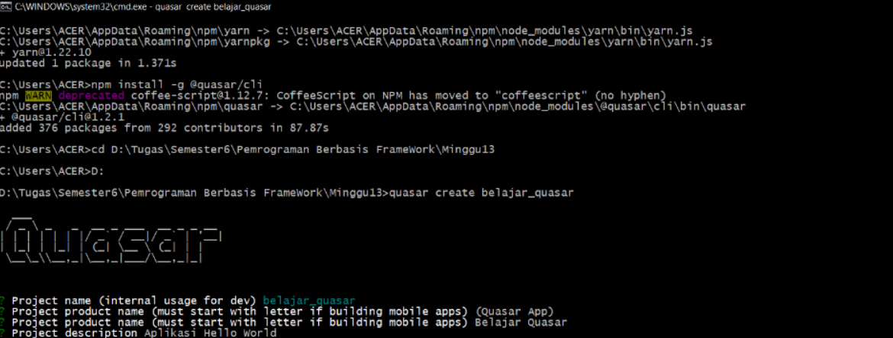
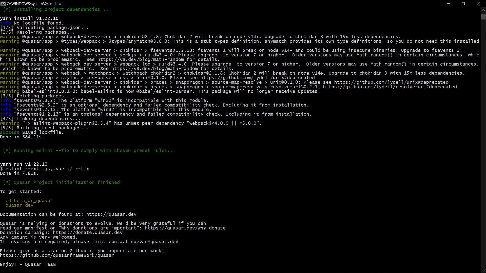
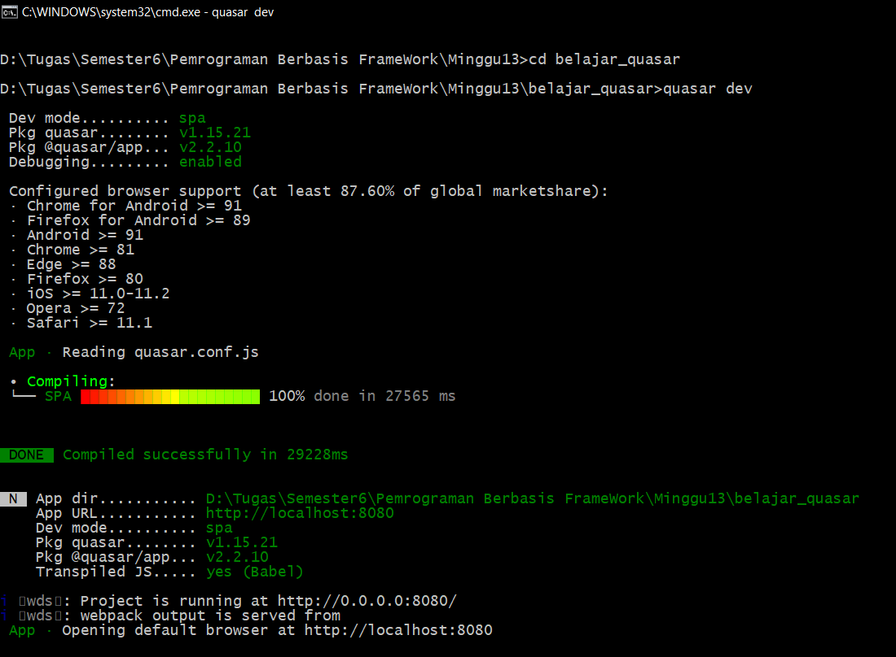
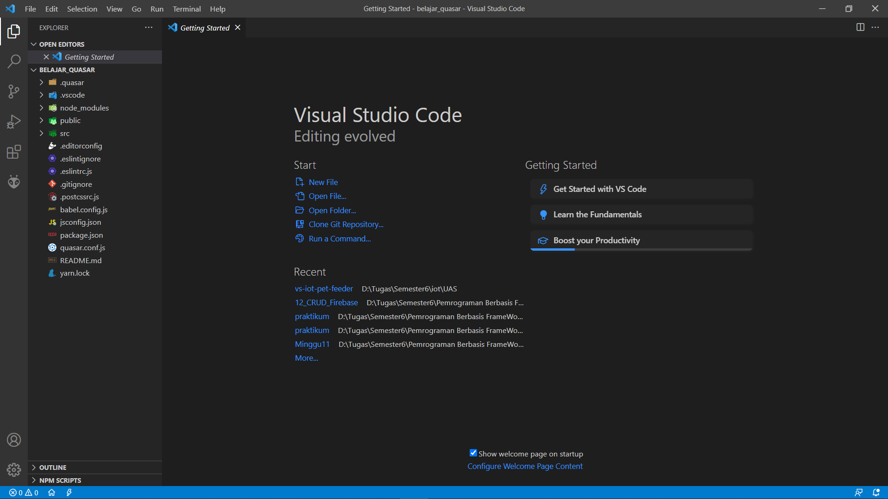
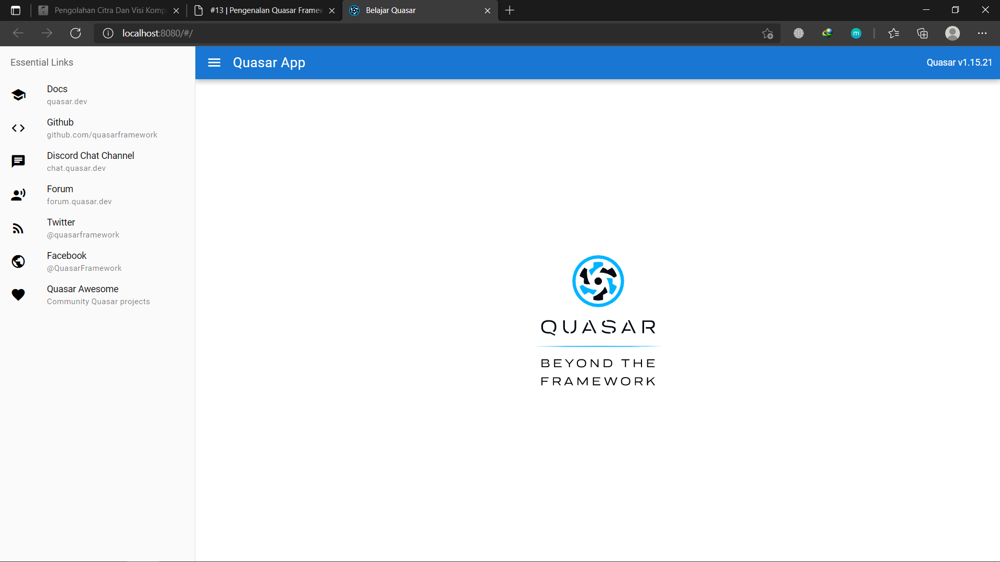

# 13 - Pengenalan Quasar Framework

## Tujuan Pembelajaran

1. Pada codelab ini Anda akan mempelajari tentang pengenalan Quasar Framework.

### Hasil Praktikum

1. Praktikum 1

2. Praktikum 2

## TUGAS PRAKTIKUM

*SOAL*

1. Berdasarkan praktikum 1 yang telah Anda lakukan, jelaskan kegunaan file quasar.conf.js ?

2. Jelaskan maksud istilah SPA, SSR, PWA, BEX, Electron app, Cordova, dan Linting code!

3.Jelaskan maksud dan perbedaan ES6, ECMAScript 6, dan ECMAScript 2015 !

*Jawaban :*

1.

2.

3.

## Pernyataan Diri

Saya menyatakan isi tugas, kode program, dan laporan praktikum ini dibuat oleh saya sendiri. Saya tidak melakukan plagiasi, kecurangan, menyalin/menggandakan milik orang lain.

Jika saya melakukan plagiasi, kecurangan, atau melanggar hak kekayaan intelektual, saya siap untuk mendapat sanksi atau hukuman sesuai peraturan perundang-undangan yang berlaku.

Ttd,

***(Ika Lailatuzzahro)*** 